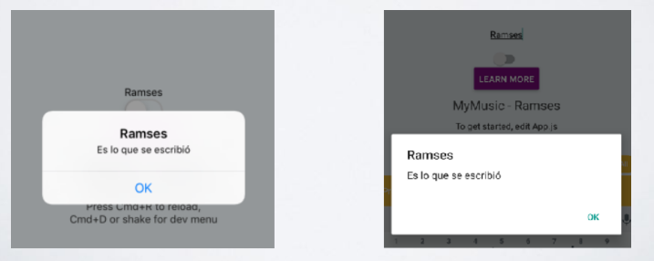

# Practica-R1---Text-input-y-Alert-en-React-Native

Programación Móvil
Practica R1 Text Imput y Alert en react

## Objetivos 🥅
Práctica R1

1. Agregar un TextInput arriba del switch

2. Cada que cambie el valor del TextInput,

actualizarlo en el state.

3. Al presionar el botón, imprimir un Alert

## Resultado esperado

